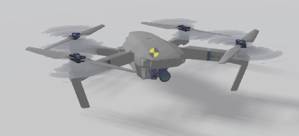
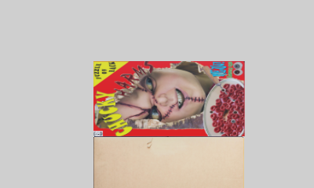

# Position Based Visual Servoing for Mavic 2 Pro

Position-based visual servoing (PBVS) is a technique that uses a camera to control the pose of a robot's end-effector relative to a target object in 3D space. PBVS is a model-based technique that estimates the pose of the target object in relation to the camera, and then issues a command to the robot controller.

In this project, PBVS is simulated in webots for the flight control of the Mavic 2 Pro drone to get it to a target image. This target image is shown below.

You can see the full video of the simulation on this [link](./images/mavic_2_pro_PBVC.mp4)

Full detailed project can be found on [this file](Proyecto%20Control%202%20Marco%20Esquivel.pdf) even thought it is written in Spanish.
