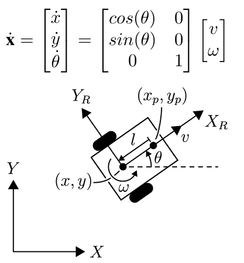
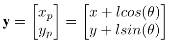
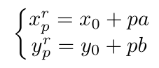
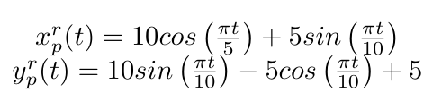

# Non-linear MIMO State Feedback Control

A Differential Drive Robot (DDR) system, whose model is shown below, is used in this project to apply a non-linear MIMO state feedback control.

The output of the system is then

## Lie Derivatives Control

We bring the robot to the origin from an initial position first by applying Lie Derivatives. In the example below, we go from $x = [3, 3, 0]$ to the origin.

  

## Dynamic Extension Control

With the Dynamic Extension approach, we add an additional dynamic to the system so it increases in order. In this case we add $\dot{v} = \mu$. Again we bring the robot to the origin.

  

## Straight Line Tracking

Now we want the robot to follow a straight line. Tis line is parameterized as follows.

Here we can see the results by applying Lie Derivatives.

  

## Parameterized Curve Tracking

Finally, we use a more complex than a straight line curve for the robot to follow.

  
