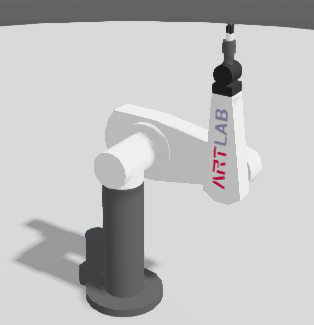
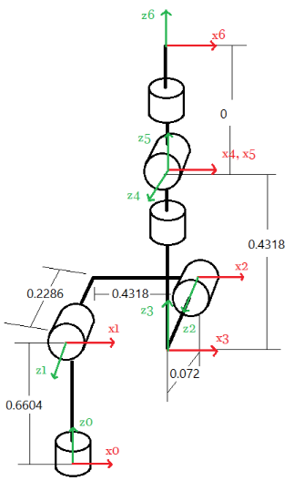
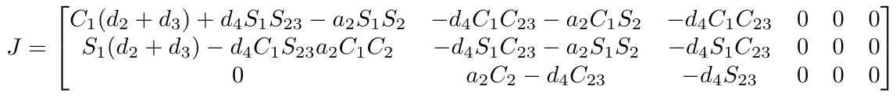
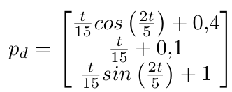

# Robot Arm-Like Kinematic Control

 

Robot PUMA 560 (shown above), is an arm-like robot with six DoF. The geometric model is also depicted, which is needed for the Denavit-Hartenberg convention application. In this project, kinematic control is used to bring the robot's end-effector to a desired pose.

Simulation is run on Matlab. You would also need to install the [ROBOTICS TOOLBOX](https://petercorke.com/toolboxes/robotics-toolbox/) by Peter Corke in order to run the implementation.

## Single pose control

The Jacobian matrix is fundamental on the kinematics control. If derived for the current robot we would get (For more details, please go to [this file](Tarea4_MarcoEsquivel.pdf))

However, the ROBOTICS TOOLBOX has embedded a function to get to this matrix. We use both approaches to bring the robot's end-effector from a initial to a desired pose. In te images below, the yellow ball represents the desired position.

  

## Trajectory tracking

To follow a trayectory, we define the eror between the current pose $p$ and the desired pose $p_d$. In the simulation, the robot follows a trajectory parametrized by

The result can be seen below.

Full detailed project can be found on [this file](Tarea4_MarcoEsquivel.pdf) even thought it is written in Spanish.